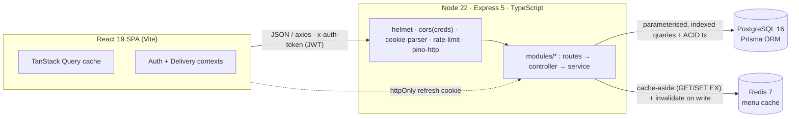
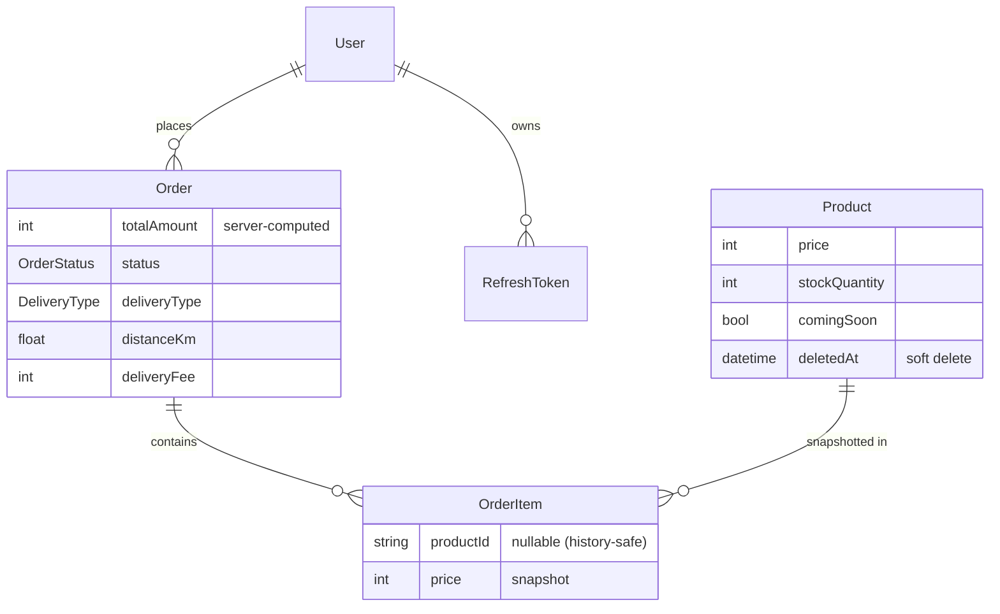

# 🍰 Shri Krishna Bakers — Full-Stack Ordering & Delivery Platform

A production-grade food-ordering system for a live bakery: a customer storefront
(geolocated delivery, cart, OTP auth, live order tracking) **and** an admin
console (POS, live kitchen board, analytics, store configuration). Built as a
TypeScript monorepo with a server-authoritative domain layer, relational data
modelling, and a Redis read cache — fully containerized and runnable in three
commands.

> **Engineering metrics:** ~2,140 LOC backend (TypeScript) · ~3,680 LOC frontend ·
> 10 Prisma models · 18 DB indexes/constraints · 12 integration tests · CI on every push.

**Stack:** React 19 · Vite 7 · TanStack Query 5 · Tailwind 3 · Node 22 · TypeScript 5.7 ·
Express 5 · Prisma 6 · PostgreSQL 16 · Redis 7 · Zod 4 · JWT · Vitest + Supertest · Docker · GitHub Actions

---

## 1. System Architecture & Data Flow

### Design paradigm
A **RESTful, layered modular monolith** — not microservices (deliberate: a single
bakery's load doesn't justify the operational tax of distributed services), and
not event-driven (a message queue/BullMQ was scoped out because the only async
work — email — is low-volume; see §2). The system is characterised by:

- **Server-authoritative domain logic** — money, stock, and serviceability are
  *never* trusted from the client; the server recomputes them from the database.
- **Strict request pipeline** — `routes → controller → service → data-access`,
  one responsibility per layer (HTTP parsing, orchestration, business logic, IO).
- **Cache-aside read path** — read-heavy catalogue served from Redis with
  write-through invalidation.
- **Stateless access + stateful refresh auth** — short-lived JWTs for requests,
  DB-backed rotating refresh tokens for sessions.
- **An explicit order-status state machine** (`OrderStatus` enum:
  `ORDER_PLACED → PREPARING → OUT_FOR_DELIVERY → DELIVERED`, plus `CANCELLED`),
  advanced from the admin Kitchen Board and surfaced to the customer via polling.

### Component topology


### Request lifecycle (every API call)
```
helmet → CORS(credentials) → cookie-parser → JSON body (1 MB cap)
       → pino-http (structured logging) → express-rate-limit (/api)
       → [requireAuth → adminOnly] → validate(Zod) → [idempotency]
       → controller → service → Prisma / Redis
       → asyncHandler catches throw → central errorHandler → uniform JSON
```

### Read path vs. write path
- **Read (e.g. `GET /menu`):** controller → `productService.getMenu()` →
  `cached(key, 60s, fetcher)` ([lib/cache.ts](backend/src/lib/cache.ts)). Cache hit
  returns parsed JSON; miss runs one indexed query and back-fills Redis. Every
  Redis op is wrapped so a cache outage degrades gracefully to Postgres.
- **Write (e.g. `POST /place-order`):** controller → `orderService.placeOrder()`
  runs the entire mutation inside a **single Prisma `$transaction`** (price
  recompute + atomic stock decrement + coupon resolution + insert), then writes
  invalidate the affected cache keys.

### Frontend data flow
The SPA holds **no hand-rolled fetch state**. TanStack Query owns server cache,
dedupe, retries, and background refetch ([src/hooks](src/hooks)). Two React
contexts hold cross-cutting client state: `AuthContext` (single source of auth
truth) and `DeliveryContext` (geolocation + derived serviceability). A response
interceptor performs **silent token refresh** with a request queue so a 401 never
surfaces to the user ([src/utils/api.js](src/utils/api.js)).

---

## 2. Core Technical Challenges & Engineering Decisions

### 2.1 Price & total integrity (the headline correctness guarantee)
**Problem:** the original code persisted `totalAmount` and per-item `price`
straight from the request body — a client could order a ₹500 cake for ₹1.
**Solution** ([modules/order/service.ts](backend/src/modules/order/service.ts)):
the server **recomputes every line from the DB** and ignores client prices/totals
entirely; the delivery fee and coupon discount are also recomputed server-side.
Proven by [tests/order.integrity.test.ts](backend/tests/order.integrity.test.ts).

### 2.2 Stock concurrency without overselling
**Problem:** two simultaneous checkouts for the last unit must not both succeed.
A naïve read-then-write races. **Solution:** an **atomic conditional update**
inside the order transaction:
```ts
UPDATE "Product" SET "stockQuantity" = "stockQuantity" - $qty
WHERE id = $id AND "stockQuantity" >= $qty;     // updated.count === 1 ⇒ winner
```
Row-level atomicity in Postgres guarantees exactly one writer succeeds; the others
get `count === 0` and are rejected. No explicit locks, no lost updates. Proven by
[tests/order.concurrency.test.ts](backend/tests/order.concurrency.test.ts) (5
parallel orders for 1 unit → 1 success, 4 rejections, final stock = 0).

### 2.3 Idempotent checkout (reserve-first pattern)
Double-taps and network retries must not create duplicate orders.
[middleware/idempotency.ts](backend/src/middleware/idempotency.ts) **reserves** the
client's `Idempotency-Key` as a unique row *before* processing (the
`@unique` constraint makes concurrent duplicates collide at the DB), then captures
and persists the response. A replay returns the stored response verbatim.

### 2.4 PostgreSQL + Prisma over MongoDB — *why relational*
The original used MongoDB. It was migrated to Postgres because the domain is
inherently **relational and transactional**: orders ↔ order-items ↔ products ↔
users with referential integrity, and checkout requires **ACID multi-row
transactions** (stock decrement + order insert must be all-or-nothing).
Prisma adds compile-time-typed queries and versioned migrations. Document stores
make these guarantees awkward; a relational engine makes them native.
*Migration constraint handled:* a serialization shim
([lib/serialize.ts](backend/src/lib/serialize.ts)) adapts Prisma shapes back to the
exact contract the existing React app expected (cuid `id` → `_id`, enum →
display string, `Role` → lowercase, relation → nested `userId`) — so the data
layer was swapped with **zero UI changes**.

### 2.5 Redis cache-aside for the catalogue
The menu is read on nearly every page and changes rarely → a textbook cache
candidate. `getMenu`/`getBestsellers` use cache-aside with a 60 s TTL; **every
product mutation invalidates the keys** ([modules/product/service.ts](backend/src/modules/product/service.ts))
so customers never see stale stock/pricing. Admin reads stay uncached for
freshness. (BullMQ/queues were intentionally excluded — no workload justified the
extra moving parts.)

### 2.6 JWT access + rotating refresh tokens
Auth uses a **two-token model** ([lib/jwt.ts](backend/src/lib/jwt.ts),
[modules/auth/service.ts](backend/src/modules/auth/service.ts)): a stateless
**15-minute access token** (sent as `x-auth-token`) and a **7-day refresh token**
delivered as an `httpOnly` cookie and stored **hashed** in the DB. On refresh the
old token is revoked and replaced (**rotation**) — a replayed/stolen refresh token
is already revoked, so it's rejected. Passwords use bcrypt (cost 10); OTPs are
generated with `crypto.randomInt` and stored hashed with a 10-minute expiry.

### 2.7 Keyless geospatial serviceability
Delivery serviceability uses the **Haversine** great-circle formula
([lib/geo.ts](backend/src/lib/geo.ts)) against an **admin-configurable** bakery
location + radius — no Maps API key, no map widget, no recurring cost. The browser
Geolocation API supplies the customer's coordinates; distance, the
distance-tiered delivery fee, and business-hours gating are all evaluated in
[lib/serviceability.ts](backend/src/lib/serviceability.ts) and **re-enforced
server-side** at checkout.

---

## 3. Data Integrity & Edge-Case Handling

| Concern | Mechanism | Where |
|---|---|---|
| **ACID checkout** | Whole order (price recompute, stock decrement, coupon, insert) in one `prisma.$transaction` — all-or-nothing | [order/service.ts](backend/src/modules/order/service.ts) |
| **Race conditions** | Atomic conditional `UPDATE … WHERE stock >= qty`; unique-constraint reservation for idempotency | order service · idempotency middleware |
| **RBAC** | `requireAuth` verifies JWT → typed `req.user`; `adminOnly` gates every `/admin/*` route; role re-checked, never client-asserted | [middleware/auth.ts](backend/src/middleware/auth.ts), [adminOnly.ts](backend/src/middleware/adminOnly.ts) |
| **Validation** | Zod schemas validate & coerce **every** request body; `z.infer` derives the TS types from the same schema (one source of truth) | [middleware/validate.ts](backend/src/middleware/validate.ts), `modules/*/schemas.ts` |
| **Geofence / hours** | Distance ≤ admin radius and within open hours re-checked server-side; forged out-of-range orders rejected | serviceability + order service |
| **Error handling** | `asyncHandler` funnels all throws to one `errorHandler`; uniform `{ error, msg }` shape; internal details hidden in prod; Prisma error codes (P2002/P2025) mapped to 409/404 | [errorHandler.ts](backend/src/middleware/errorHandler.ts) |
| **Referential safety** | **Soft delete** (`deletedAt`) via a Prisma client extension keeps historical order-items intact; FK cascade on order-items | [db/prisma.ts](backend/src/db/prisma.ts) |
| **Auditability** | Append-only `AuditLog` records actor/action/entity/ip for every admin mutation | [lib/audit.ts](backend/src/lib/audit.ts) |
| **Frontend resilience** | `ErrorBoundary` prevents white-screens; silent JWT refresh with a queued-request interceptor; optimistic-free, cache-invalidated mutations | [ErrorBoundary.jsx](src/components/ErrorBoundary.jsx), [utils/api.js](src/utils/api.js) |
| **Abuse / hardening** | helmet headers; CORS allow-list + credentials; global rate limit **500 req / 15 min / IP** on `/api`, **30 / 15 min** on auth routes; 1 MB body cap; env validated at boot | [app.ts](backend/src/app.ts), [config/env.ts](backend/src/config/env.ts) |

---

## 4. Quantifiable Scale & Performance

> **Methodology note:** the figures below are **analytical** (derived from
> algorithmic complexity, the index plan, and the runtime model), *not* load-test
> measurements. They're written to be defensible from first principles; validate
> empirically with `autocannon`/`k6` against a deployed instance.

### Time/space complexity of the hot paths
| Path | Complexity | Notes |
|---|---|---|
| `GET /menu` (cache hit) | **O(1)** Redis `GET` + **O(m)** JSON parse | `m` = catalogue size (≈10² items); served from RAM, no DB round-trip |
| `GET /menu` (cache miss) | **O(m log N)** single B-tree-indexed scan | back-fills Redis; `N` = total products |
| `POST /place-order` | **O(k)** DB ops in 1 transaction | `k` = distinct cart lines; each line = 1 PK lookup + 1 atomic `UPDATE` |
| Serviceability / Haversine | **O(1)** | constant-time trig; no external API |
| Idempotency reserve | **O(1)** | single unique-key insert (B-tree) |
| `GET /admin/analytics` | **O(1)** aggregates + **O(d)** JS bucketing | `_sum/_count` use `createdAt` index; `d` = orders in the 7-day window |
| Auth verify / sign | **O(1)** JWT; bcrypt **O(2¹⁰)** *by design* | bcrypt cost 10 is deliberately ~tens of ms to resist brute force |

### Indexing & query efficiency
18 indexes/constraints back the read patterns: `Product(category, isBestseller, deletedAt)`,
`Order(userId, status, createdAt)`, `OrderItem(orderId)`, unique indexes on
`User.email`, `RefreshToken.tokenHash`, `IdempotencyKey.key`, `Coupon`/`BlogPost`.
Result: the customer's "my orders", the kitchen board's status filter, and the
analytics date-range scan are all **index range-scans**, not sequential scans —
they stay logarithmic as the order table grows.

### Network payloads
Responses are lean, purpose-built serializer outputs (no over-fetching): a
serialized product is ~10 scalar fields, so the full ~22-item menu is a few KB of
JSON (≈1 KB gzipped over HTTP). An access-token JWT is ~200 bytes. The Vite
production bundle is ~840 KB / ~263 KB gzipped (single chunk; code-splitting is a
noted future optimization).

### Theoretical throughput (single Node instance, analytical)
- **Cached reads** (`/menu`, `/store-settings`, `/coupons`): bounded by the event
  loop + JSON serialization, not the DB — comfortably **low-thousands of req/s**
  on one core for KB-scale payloads.
- **Transactional writes** (`/place-order`): bounded by Postgres write throughput
  and the Prisma connection pool (default ≈ `cpus×2+1`); realistically **hundreds
  of orders/s** per instance before the DB is the bottleneck — far beyond a single
  bakery's needs, and horizontally scalable because the API is stateless (JWT) with
  shared state externalised to Postgres/Redis.
- **Configured ceilings:** 500 req/15 min/IP global, 30/15 min on auth — the
  deliberate guardrails, tunable in [app.ts](backend/src/app.ts).

---

## Data model

10 models / 4 enums ([schema.prisma](backend/prisma/schema.prisma)):
`User`, `Product`, `Order`, `OrderItem`, `RefreshToken`, `IdempotencyKey`,
`AuditLog`, `StoreSettings`, `Coupon`, `BlogPost`.


Money is stored as **integer rupees** (no floating-point currency bugs).

---

## Project structure
```
backend/
  prisma/schema.prisma          # 10 models, 4 enums, 18 indexes
  src/
    config/env.ts               # Zod-validated, fail-fast env
    db/{prisma,seed}.ts         # client (+ soft-delete extension), mock data
    lib/                        # ApiError, asyncHandler, jwt, serialize, geo,
                                #   serviceability, cache, redis, audit, logger, mailer
    middleware/                 # auth, adminOnly, validate, idempotency, errorHandler
    modules/{auth,order,product,admin,store,coupon,blog}/   # routes→controller→service→schemas
    app.ts / server.ts          # composable app (testable) + graceful shutdown
  tests/                        # Vitest + Supertest (integrity, concurrency, idempotency, auth, geofence, coupons)
src/                            # React SPA — api/ hooks/ context/ pages/ components/ admin/
docker-compose.yml              # Postgres 16 + Redis 7
.github/workflows/ci.yml        # lint · typecheck · test · build
```

---

## Run it locally
**Prerequisites:** Node 22 + a Docker runtime (Colima on macOS).
```bash
docker compose up -d                 # Postgres + Redis
cd backend && cp .env.example .env && npm install
npm run prisma:migrate && npm run seed && npm run dev   # API on :5001
# in repo root, another terminal:
npm install && npm run dev           # SPA on :5180   (or `npm run dev:all`)
```
**Seeded logins:** admin `admin@krishna.test / Admin@123` · customer
`aarav@test.com / Password@123` (signup OTPs print to the backend console in dev).

## Testing & CI
```bash
cd backend && npm test     # 12 integration tests against an isolated PG schema
```
Vitest + Supertest exercise the security-critical paths (price tampering, stock
concurrency, idempotency replay, auth/RBAC, geofence, coupons). GitHub Actions
([ci.yml](.github/workflows/ci.yml)) spins up Postgres + Redis service containers
and runs **lint → typecheck → test → build** on every push and PR.
