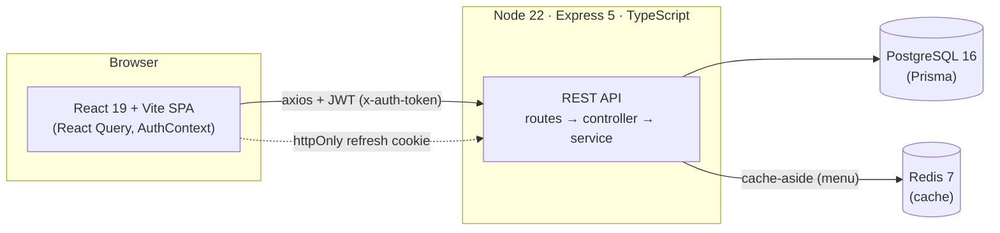
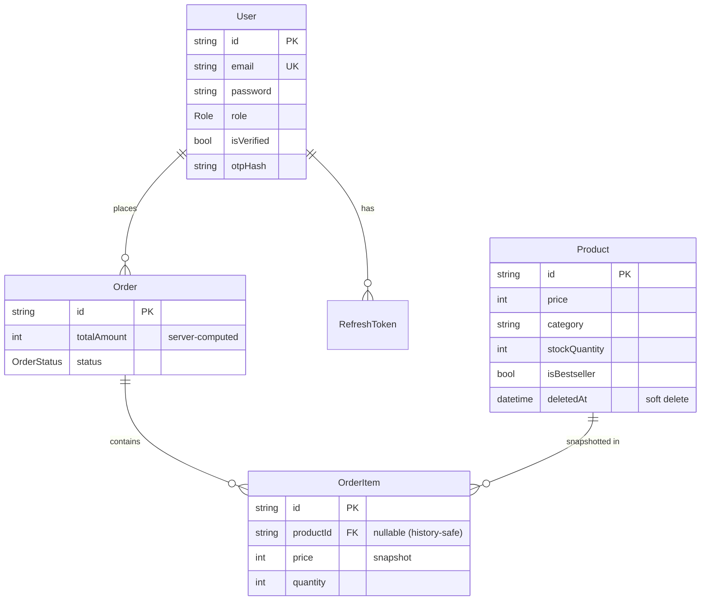
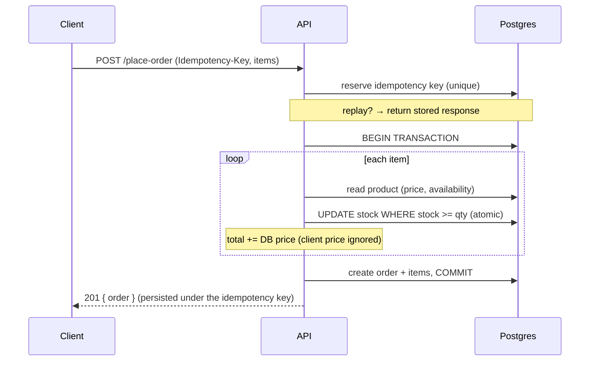

# Architecture

## System overview



The frontend talks to the API over JSON. The **access token** rides in the
`x-auth-token` header; the **refresh token** lives in an httpOnly cookie the
browser sends automatically. Postgres is the source of truth; Redis is a
read-through cache for the menu only.

## Request lifecycle (middleware order)

```
helmet → cors(credentials) → cookieParser → json body parser
       → pino-http (logging) → rate limiter
       → route → [requireAuth] → [adminOnly] → [validate(zod)] → [idempotency]
       → controller → service → Prisma/Redis
       → (on throw) asyncHandler → central errorHandler
```

Every async handler is wrapped so thrown errors land in **one** error handler
that returns a consistent `{ error, msg }` shape.

## Backend layering

```
routes/         URL + middleware wiring only
modules/<x>/
  schemas.ts    Zod input validation (+ inferred TS types)
  controller.ts HTTP in/out only (req → service → res)
  service.ts    business logic + data access (no req/res → unit-testable)
lib/            cross-cutting: ApiError, asyncHandler, jwt, serialize, cache, audit, logger, mailer
middleware/     auth, adminOnly, validate, idempotency, errorHandler, notFound
db/             Prisma client (+ soft-delete extension), seed
config/         Zod-validated env
```

## Data model



`AuditLog` and `IdempotencyKey` are standalone tables (not shown) supporting
admin action history and duplicate-order prevention.

## Checkout flow (the critical path)



## Compatibility shim (why the UI never changed)

The original frontend was built for MongoDB. The Prisma backend keeps it working
untouched via `lib/serialize.ts`:

- Prisma `id` (cuid) → exposed as **`_id`**
- `OrderStatus` enum (`ORDER_PLACED`) → **`"Order Placed"`** display strings
- `Role` enum (`ADMIN`) → lowercase **`"admin"`**
- loaded `user` relation → nested **`userId`** object (mimics Mongoose populate)
